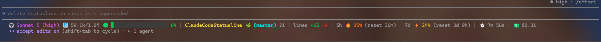

# Claude Code Statusline

A custom status line for [Claude Code](https://docs.claude.com/en/docs/claude-code) that replaces the default line with a single, information-dense bar covering your repo, git state, context usage, rate limits, session cost, and more — all in 24-bit truecolor.

This repository also includes a native [Codex CLI](https://developers.openai.com/codex/cli/) preset. Codex currently configures its footer with an ordered list of built-in status items, so the Codex version is a configuration preset rather than a port of the Claude stdin-driven script.



## What it shows

Reading left to right:

- 🤖 **Model** — display name, plus the reasoning effort level in parentheses when set (e.g. `Sonnet 5 (high)`)
- 🪟 **Context usage** — a gradient bar (green → yellow → red, up to 20 blocks) with tokens used vs. max context window
- **Repo & branch** — repo name, current directory leaf (if different from the repo root), and the git branch, prefixed with 🌿
- 🌳 **Worktree** — when the session is running inside a git worktree, its name is shown next to the branch
- **Dirty status** — counts of modified (`~`), untracked (`?`), added (`+`), and deleted (`-`) files
- **Lines changed** — `+added`/`-removed` line counts for the session
- **Rate limits** — 5-hour and 7-day usage percentages with an emoji threshold indicator (🟢/⚡️/🔥/🚨) and a reset countdown
- ⏱️ **Session duration** — cumulative wall-clock time for the current Claude Code session. Shown as `Xm Ys`, or `Xh Ym` once it passes 60 minutes.
- 💵 **Session cost** in USD

Colors and emoji thresholds scale automatically: usage under 20% is green/🟢, 20–70% is yellow/⚡️, 70–90% is orange/🔥, and 90%+ is red/🚨.

The context bar, branch name, and repo name all shrink dynamically so the whole line always fits within the terminal width. Terminal width is detected from the `COLUMNS` environment variable Claude Code provides (since the script's stdout isn't a TTY, `process.stdout.columns` isn't available), falling back to parsing `mode con` on Windows when `COLUMNS` is unset, and finally a hardcoded 120 if neither is available. A fixed margin also accounts for the few columns of chrome Claude Code itself reserves around the rendered statusline row.

When the line is too long, three things shrink in order, each only kicking in once the previous one can't free up enough room on its own:

1. **The context bar shrinks first**, by drawing fewer of its (up to 20) blocks — fully redrawn at every size, not just cut off, so the fill proportion and gradient colors are always correct — down to 0 blocks (just the label, emoji, and percentage) if needed. It also collapses straight to 0 blocks whenever a worktree indicator is shown, to make room for it.
2. **The branch name shrinks second** (with a `…`), sized against the full, untruncated repo name.
3. **The repo name shrinks third** (with a `…`), against whatever budget is left once the branch is already final.

A final whole-line safety net hard-truncates the entire rendered line as a last resort, so it can never overflow and get cut off mid-segment by the terminal itself.

Below 160 columns (e.g. a non-maximized window or a split pane), the line switches to a **2-row layout** instead of shrinking everything to fit one row: model, context bar, and repo/branch/dirty-status on row 1; lines changed, rate limits, session duration, and cost on row 2. Each row gets the full terminal width to itself, so the context bar and branch/repo name typically need less shrinking than they would squeezed onto a single wide line.

## Install

For Claude Code, clone this repo and run `/statusline` inside Claude Code, pointing it at `statusline.js` from your local clone.

### Codex CLI

Copy the `[tui]` block from [`codex-statusline.toml`](./codex-statusline.toml) into your Codex config file:

```text
%USERPROFILE%\.codex\config.toml   # Windows
~/.codex/config.toml                # macOS/Linux
```

The preset shows model/reasoning, project name, current directory, git branch, context used, token count, and the 5-hour/weekly rate limits.

You can also run `/statusline` in the Codex TUI to adjust the order interactively.

## Files

- **`statusline.js`** — the primary, actively maintained implementation (Node.js, no dependencies beyond built-ins). Includes rate limits, effort level, session duration, cost, and dynamic context-bar/branch/repo-name shrinking to fit the terminal width.
- **`statusline.sh`** ⚠️ **obsolete** — an earlier, simpler bash/jq/awk implementation covering only the core repo/branch/context/cost/velocity/model segments. Superseded by `statusline.js`, which has since gained rate limits, effort level, session duration, dirty-status breakdown, and dynamic branch truncation that were never ported back to the bash version. Kept around for reference only; not recommended for new setups.

**AI Disclaimer:** _This repo is 100% written and maintained by Claude Code — every commit, feature, and this README included._
